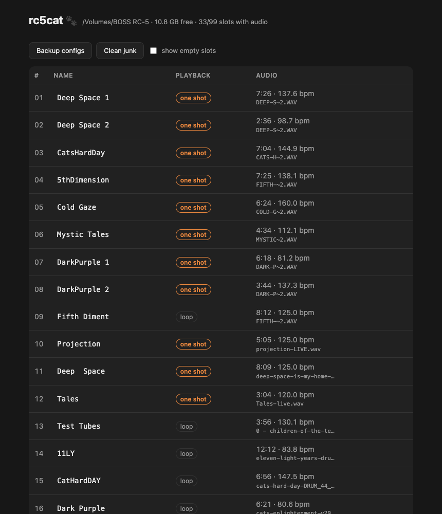

# rc5cat 🐾

**Command-line manager for the BOSS RC-5 Loop Station.**
Name your memory slots from a real keyboard, upload backing tracks from your DAW,
and keep the pedal's USB storage healthy — all in seconds instead of an evening
of knob-scrolling.

Zero dependencies. Node.js ≥ 20. macOS / Windows / Linux
(exercised against real hardware on macOS; reports from other platforms welcome).

```console
$ rc5cat ls
01  Deep Space 1  [1shot]  7:26  137.6 bpm
02  Deep Space 2  [1shot]  2:36   98.7 bpm
03  CatsHardDay   [1shot]  7:04  144.9 bpm
...

$ rc5cat push drums.wav --slot 4 --name "5thDimension" --oneshot
uploaded drums.wav (float32, 7:25) → slot 4
configured: 256 measures @ 138.1 bpm
backup: ~/.rc5cat/backups/2026-07-19T18-00-00-000Z
done — eject safely, then reboot the pedal
```

## Why

The RC-5 is a great pedal with a terrible data-entry story:

- Naming a slot on the device means scrolling through a character list with a
  knob, twelve times per slot, ninety-nine slots.
- The official desktop app is close to useless: in practice it does exactly
  one thing — upload a WAV — and fills the rest of the screen with videos you
  didn't ask for. No slot naming, no diagnostics. Underneath, the pedal in USB
  `STORAGE` mode is just a flash drive with well-formed files on it — no
  vendor software needed at all.
- Worst of all: put files onto the mounted pedal by hand — a Finder drag, a
  `cp` — and on macOS every copy silently plants an **invisible metadata
  sidecar** (`._*`, AppleDouble) next to it. On the next boot the pedal can
  greet you with `LOOPER DATA READ ERR` and refuse to start, and nothing on
  screen tells you why.

rc5cat does the file surgery correctly, verifies every write, backs up before
touching anything, and sweeps the landmines afterwards.

## Prerequisites

- **[Node.js](https://nodejs.org) ≥ 20** — that's the only requirement. The
  installer bundles `npm` and `npx`, which is all the commands below use.
  Check yours with `node --version`.
- No git, no build tools, no vendor software needed.

## Install

The quickest way — run straight from GitHub, nothing to install:

```console
$ npx -y github:AliceLafox/rc5cat status
```

For regular use, put `rc5cat` on your PATH:

```console
$ git clone https://github.com/AliceLafox/rc5cat && cd rc5cat
$ npm link        # now plain `rc5cat` works from anywhere
$ npm test        # full suite: no network, no pedal required
```

## Usage

Connect the pedal via USB and enter `STORAGE` mode (SETUP → USB → STORAGE).
It mounts as a regular flash drive — no drivers, no vendor software. rc5cat
finds it automatically by content (so a renamed volume still works); pass
`--volume` to point at it explicitly.

| Command | What it does |
|---|---|
| `rc5cat status` | Volume, free space, slot and junk summary |
| `rc5cat ls [--all]` | List slots: name, duration, tempo, One Shot flag |
| `rc5cat backup [--to DIR]` | Copy the pedal's config files to a dated folder |
| `rc5cat rename <slot> <name>` | Set a slot's display name (≤ 12 ASCII chars) |
| `rc5cat oneshot --on\|--off <slot...>` | Toggle One Shot playback per slot |
| `rc5cat push <file.wav> --slot N [--name X] [--oneshot]` | Upload a 44.1 kHz stereo WAV into a slot |
| `rc5cat pull <slot...> \| --all [--to DIR]` | Copy slot audio to disk — meaningful filenames are kept, pedal-technical ones become `"NN - Slot Name.wav"` |
| `rc5cat clear <slot...> [--keep-name] [--no-trash]` | Reset slots to factory state; the wav goes to `~/.rc5cat/trash` unless you opt out with `--no-trash` |
| `rc5cat clean` | Remove AppleDouble junk from the volume |
| `rc5cat doctor` | Full health check — run this if the pedal won't boot |
| `rc5cat ui` | All of the above in your browser — see below |

Every mutating command automatically backs up the configs first
(`--no-backup` to skip, `--backup-dir` to relocate), writes **both** memory
files with their correct per-file trailers, re-reads them to verify, and
sweeps metadata junk. Always eject the volume before unplugging.

`push` uploads the audio *and* writes the slot configuration in one step.
Prefer the pedal to do its own bookkeeping? Use `push --no-config`, reboot the
pedal (it indexes new files at boot), then `rename` the slot.

## The browser UI

Not a terminal person? `rc5cat ui` opens a local page in your browser:

```console
$ npx -y github:AliceLafox/rc5cat ui
rc5cat ui at http://127.0.0.1:5023/  (Ctrl-C to stop)
```

Click a slot name to rename it, click the playback badge to switch between
loop and One Shot, drag a WAV from Finder straight onto a slot row to upload
it, hit ⬇ to download a slot's audio to your computer (loops you recorded on
the pedal included), and ✕ to clear a slot (the wav is moved to the trash
folder on your computer first). Health problems show up as banners at the top.



Everything runs on your machine: the page is served on `127.0.0.1` only,
every action requires a per-run token, and foreign `Host` headers are
rejected — nothing is ever reachable from the network.

## How the RC-5 stores data

Documented nowhere else, verified byte-by-byte against real hardware. This is
the knowledge rc5cat is built on — useful even if you never run the tool.

**Layout.** In `STORAGE` mode the pedal exposes a FAT volume:

```
ROLAND/
  DATA/MEMORY1.RC0     ← all 99 slot configs, XML
  DATA/MEMORY2.RC0     ← its twin (see below)
  WAVE/001_1/ … 099_1/ ← one folder per slot, one WAV inside
```

**Memory files.** `MEMORY*.RC0` is XML: 99 `<mem id="0..98">` blocks, each with
`NAME`, `TRACK1`, `MASTER`, `RHYTHM` sections of plain integer fields. Slot
names are twelve ASCII codes in `<C01>…<C12>`. The two files carry the same
content; on boot, if `MEMORY2` fails validation, the pedal heals it from
`MEMORY1`.

**The trailer.** After `</database>` each file ends with four extra bytes that
look like garbage but are a **per-file marker**: `8\0\0\0` for MEMORY1,
`9\0\0\0` for MEMORY2. Write the wrong marker and the pedal greets you with
`LOOPER DATA READ ERR`. rc5cat always writes the right one and `doctor` checks it.

**Boot-time indexing.** Drop a WAV into an empty slot folder and reboot: the
pedal finds it, fills the slot config itself, normalizes the file (strips DAW
metadata chunks down to a 56-byte header, may shorten the filename to DOS 8.3),
and derives tempo parameters with this exact algorithm:

- pick the **largest power-of-two measure count** whose implied tempo is
  ≤ 160 BPM, where `BPM = beats × 2,646,000 / frames` (2,646,000 = samples per
  minute at 44.1 kHz, 4 beats per measure);
- store the tempo in tenths of BPM, **truncated**, in `RecTmp` and `Tempo`;
- store the measure count in `MeasLen` and `LpLen`, and that count **plus 7**
  in `Measure`.

`rc5cat push` reproduces this algorithm bit-for-bit (it is pinned by tests to
values a real pedal computed) **and pre-normalizes the file into the pedal's
canonical form before writing it** (verified byte-identical against files the
pedal normalized itself). The result: a pushed slot is indistinguishable from
a pedal-indexed one, the pedal never rewrites your upload at boot — and your
long filenames survive, which is more than the vendor path can say.

**Audio formats.** The pedal records natively in WAV 44.1 kHz **32-bit float**
stereo, and Roland's import documentation additionally lists 16-bit and 24-bit
PCM at 44.1 kHz. Your DAW's default float mixdown is a first-class citizen —
no conversion needed. rc5cat accepts exactly these (16/24-bit PCM, 32-bit
float; always 44.1 kHz stereo) and rejects everything else before it touches
the pedal; 16-bit and float32 are additionally exercised against real hardware
by this project.

**The macOS landmine.** Copying files with Finder or `cp` onto a FAT volume
writes AppleDouble sidecars (`._name`) carrying extended attributes; macOS adds
them even when the source looks clean (`com.apple.provenance`). The pedal's
parser chokes on them at boot. Every rc5cat write ends with a sweep, and
`rc5cat clean` / `rc5cat doctor` are there for volumes touched by hand.

## Safety model

- Configs are edited **surgically** on the raw bytes: anything not explicitly
  changed round-trips bit-exact, including the trailer.
- Writes go to both memory files, are re-read and compared, and are refused
  loudly on any validation error — no silent fallbacks anywhere.
- Automatic dated backups before every mutation; `rc5cat backup` for manual ones.
- `clear` is the only operation that removes audio from the pedal — so by
  default it never deletes outright: the wav is moved to a dated folder under
  `~/.rc5cat/trash` first, and the slot is reset to the pedal's exact factory
  state (captured byte-for-byte from real hardware). Opting out (`--no-trash`,
  or unchecking the UI's trash checkbox) is explicit and the confirm dialog
  says plainly that the deletion is permanent.
- Everything above is locked by tests (`npm test`), including golden parameter
  values captured from real hardware.

## On Windows

Everything should work the same: the pedal mounts as a drive letter with the
same `ROLAND\DATA` / `ROLAND\WAVE` layout, rc5cat auto-detects it (or pass
`--volume E:\`), and `clean` also sweeps Windows litter (`Thumbs.db`,
`desktop.ini`). The AppleDouble landmine is macOS-only — Windows users are
safe from that one. Backups and the clear-trash live under your user profile
(`%USERPROFILE%\.rc5cat\`); the UI always shows the exact path it uses.
Use "Safely Remove Hardware" before unplugging.
Caveat: developed and hardware-verified on macOS; Windows reports are very
welcome.

## Compatibility

Verified on one RC-5 (2026 firmware) — the file format is simple and stable,
but treat this as a community reverse-engineering effort, not vendor
documentation. **Back up before first use** (`rc5cat backup`). Reports from
other units and firmware versions are very welcome.

Not affiliated with, endorsed, or sponsored by Roland Corporation or BOSS.
BOSS and RC-5 are trademarks of Roland Corporation.

## License

[AGPL-3.0](LICENSE) — free to use, study, and improve; keep improvements free.

---

Built to feed the live rig of [Darwin's Cat](https://darwinscat.com) — a band
about a civilization of cats in space. The backing tracks in the examples are
real. 🐾
